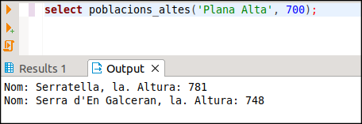
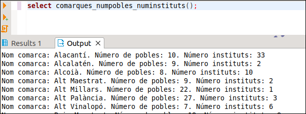

# 6. Utilització de cursors

Un cursor és una variable que ens permet desplaçar-nos per les files d’una
consulta de SQL.

Hi ha dos tipus de cursors, els **explícits** i els **implícits**.

Els explícits s'han de declarar expressament en la zona de declaracions. Els
implícits no, seran únicament una sentència SQL que guarda el resultat en una
variable. Porten implícita tota la mecànica dels cursors (declarar, obrir,
utilitzar, tancar) que haurem de fer en els explícits.

**CURSORS IMPLÍCITS**{.azul}

Consistiran en una sentència SQL dins d'un procediment o funció PL/pgSQL. Han
de **tornar només un valor** (**només una fila**), i es guardaran en una
variable per mig del **INTO** de la sentència SQL. Per exemple, la següent
funció tornarà el número de poblacions.

    
    
    CREATE FUNCTION quantes() RETURNS INTEGER AS '
    DECLARE
        N INTEGER;
    BEGIN
        SELECT COUNT(*) INTO N FROM POBLACIONS;
        RETURN N;
    END;
    ' LANGUAGE plpgsql;
    
    
    SELECT quantes();

Però ara ho fa per l'eixida normal  

**CURSORS EXPLÍCITS**{.azul}

Aquestos cursors s'han de declarar, bé en la zona de declaracions, bé en el
moment d'obrir-los, com veurem més avant. I en la zona d’instruccions, primer
haurem d’obrir (**OPEN**) el cursor (que és quan es farà la consulta SQL,
guardant-se en una zona de memòria i quedant-se situat el cursor en la primera
fila). Després ens anirem desplaçant fila a fila per fer un determinat
tractament (**FETCH** : torna el valor i se situa a la següent fila). Per
últim l’haurem de tancar (**CLOSE**).

En la declaració del cursor seguirem la següent sintaxi:

    _nom_ CURSOR [_paràmetres_] {FOR | IS} _sentència_select_

Encara que també tenim la possibilitat de definir-lo únicament com a
**refcursor** (referència a cursor), sense dir quina és la sentència select.
Aleshores l'haurem de definir en el moment d'obrir-lo. També tenim la
possibilitat de passar-li un paràmetre. Ací tenim alguns exemples de definició
de cursors:

    DECLARE  
        cur1 refcursor;  
        cur2 CURSOR FOR SELECT nom,altura FROM POBLACIONS;  
        cur3 CURSOR(p1 varchar) FOR SELECT nom,altura FROM POBLACIONS WHERE nom=p1;

La manera d'obrir-lo depèn de la manera com s'havia declarat. Si només s'havia
posat _**refcursor**_ s'haurà de col·locar la consulta. Si tenia paràmetres
s'hauran de posar entre parèntesi. Aquesta seria una manera d'obrir els 3
cursors definits anteriorment:

    BEGIN  
        OPEN cur1 FOR SELECT * FROM POBLACIONS;  
        OPEN cur2;  
        OPEN cur3('Vistabella');  
        ....
    END;

Hi ha una altra manera d'obrir els cursors definits com a _**refcursor**_ ,
que permet especificar la consulta totalment en temps d'execució. Ací en tenim
un exemple:

    s := 'SELECT nom FROM ' || $1;  
    OPEN cur1 FOR EXECUTE s;

on la taula consultada ve donada com a paràmetre de la funció.

Per accedir als distints camps de les successives files del cursor ho farem
per mig de la sentència **FETCH cur INTO var1 [, var2, ...]** i aleshores
tindrem els valors disponibles en les variables var1 (, var2, ...) que estaran
prèviament declarades del mateix tipus. Així en l'exemple de dalt, tenim que
el cursor _**cur2**_ està definit en base a una sentència SQL que torna dues
columnes (_**nom**_ i _**altura**_). La sentència hauria de ser

    FETCH cur2 INTO v_nom, v_altura

on **v_nom** i **v_altura** serien respectivament de tipus **varchar** i
**numeric**

També podríem haver definir una variable de tipus **RECORD**. En aquest
exemple suposem que la variable **f** és de tipus **RECORD**

        FETCH cur2 INTO f

Després, per a accedir a un camp, posarem **f._nom_camp_**.

Per a tancar el cursor utilitzarem la sentència **CLOSE**.

L'habitual serà recórrer tot el cursor. El següent exemple trau tots els noms
de les poblacions d'una comarca introduïda com a paràmetre de la funció,
utilitzant un cursor:

    
    
    CREATE FUNCTION pobl_com(text) RETURNS void AS $cos$
    DECLARE
        v_nom VARCHAR;
        cur CURSOR FOR SELECT nom FROM POBLACIONS
                      		WHERE nom_c = $1
                        	ORDER BY nom;
    BEGIN
        OPEN cur;
        FETCH cur INTO v_nom;
        WHILE v_nom IS NOT NULL LOOP
            RAISE NOTICE '%',v_nom;
            FETCH cur INTO v_nom;
        END LOOP;
        CLOSE cur;
    END; $cos$ 
    LANGUAGE plpgsql;

La manera d'utilitzar aquesta funció serà:

    
    
    SELECT pobl_com('Plana Alta');

Per a aquestes ocasions en les quals hem de recórrer totalment un cursor,
tenim una variant del **FOR** que ens serà molt útil.

    FOR var_fila IN sentència_select LOOP

on **var_fila** és una variable de tipus **RECORD** , i que anirà agafant els
valors de les diferents files (fixeu-vos que s'ha de declarar, en contra de
les variables comptador d'un bucle **FOR** normal). Hem d'observar que en el
cas del bucle FOR hem de declarar la sentència SELECT en el mateix moment de
crear el FOR, és a dir, no podem utilitzar un cursor definit en la zona de
declaracions.

Quan utilitzem el bucle FOR per a recórrer un cursor no caldrà fer l'acció
d'obrir, ni de situar-nos al següent, ni de tancar, ja que es fan de forma
implícita en el bucle. Reconstruïm l'exemple anterior:

    
    
    CREATE FUNCTION pobl_com_2(text) RETURNS void AS $cos$
    DECLARE
        f RECORD;
    BEGIN
        FOR f IN SELECT nom FROM POBLACIONS
                    WHERE nom_c = $1
                    ORDER BY nom
        LOOP
            RAISE NOTICE '%',f.nom;
        END LOOP;
    END;
    $cos$ LANGUAGE plpgsql;

Si volguérem construir la sentència SELECT en temps d'execució, posaríem
EXECUTE, encara que açò potser siga massa avançat per a aquest curs:

    FOR f IN EXECUTE 'SELECT nom FROM ' || $1 LOOP

Anem a veure un exemple. Volem calcular la **MEDIANA** de l'altura de les
poblacions. La mediana es defineix com el valor que està al mig de tots si el
número d’elements és imparell (1, 2, **3** , 4, 10), i com la mitjana entre
els dos valors centrals si el número és parell (1, 2, **3** , **4** , 10, 20)
-> **3’5** , tenint en compte sempre que han d'estar ordenats. És suficient
amb que entengueu el seu funcionament.

    
    
    CREATE OR REPLACE FUNCTION MEDIANA() RETURNS NUMERIC AS $cos$
    DECLARE
        cur CURSOR FOR SELECT altura FROM POBLACIONS
                        ORDER BY altura;
        aux INT2;
        aux1 INT2;
        i INT2;
        n INT2;
        n1 INT2;
    BEGIN
        OPEN cur;
        SELECT COUNT(altura) INTO n FROM POBLACIONS;
        IF MOD(n,2) = 0
            THEN n1 := n;
            ELSE n1 := n+1;
        END IF;
        FOR i IN 1..n1/2 LOOP
            FETCH cur INTO aux;
        END LOOP;
        IF MOD(n,2) = 0 THEN
            FETCH cur INTO aux1;
            aux := (aux + aux1) / 2;
        END IF;
        RETURN aux;
    END;
    $cos$ LANGUAGE plpgsql;
    
    
    SELECT MEDIANA();

## :pencil2:  Exercicis

**Ex_7** - Fes una funció anomenada **POBLACIONS_ALTES** que accepte 2 paràmetres,
el primer de tipus text que serà una comarca, i el segon numèric que serà una
altura. Ha de traure les poblacions de la comarca del primer paràmetre que són
més altes que el segon paràmetre. Mostrarem el nom de la població i l'altura.
Aquest podria ser el resultat en executar-se:

**Ex_8** - Fes una funció anomenada **COMARQUES_NUMPOBLES** sense paràmetres que
traga per pantalla les comarques ordenades alfabèticament amb el número de
pobles de cadascuna

**Ex_9** - Fes una funció anomenada **COMARQUES_NUMPOBLES_NUMINSTITUTS** sense
paràmetres que traga per pantalla les comarques ordenades alfabèticament amb
el número de pobles de cadascuna i el número d'instituts. En la consulta
tindrem dos dificultats:

  * Hem d'agafar totes les poblacions, fins i tot les que no tenen institut
  * Com que hem d'accedir als instituts, per a comptar els pobles haurem de comptar els pobles **distints** , i així si un poble té més d'un institut, no comptar-lo més d'una vegada

**Ex_10** - Fes una funció anomenada **NUM_HABITANTS_COMARCA** que accepte un
paràmetre de tipus text, i torne el número d'habitants d'eixa comarca

**Ex_11** - Fer la funció **COMARQUES_NUMHABITANTS** sense paràmetres per a traure
per pantalla totes les comarques i el número d'habitants. En la consulta has
d'utilitzar obligatòriament la funció anterior

Llicenciat sota la  [Llicència Creative Commons Reconeixement NoComercial
CompartirIgual 3.0](http://creativecommons.org/licenses/by-nc-sa/3.0/)

