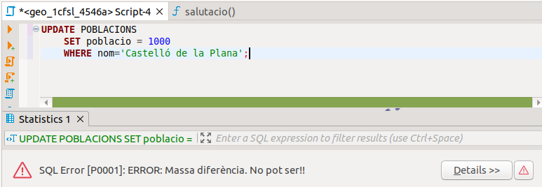
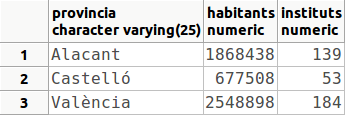

# 8. Triggers

Un **TRIGGER** o **disparador** és un procediment que se dispara quan
s’acompleix una determinada condició que afecta a la Base de Dades: quan
s’actualitza una o més d’una fila d’una determinada taula. En el moment de
crear el trigger especificarem una funció que s'executarà quan es produesca
l'event. Aquesta funció pot estar escrita en qualsevol llenguatge de
programació instal·lat, i ha de tornar un valor especial: _**trigger**_.
Juguem per tant a dues bandes. Primer amb la funció que s'executarà, i quan
aquesta estiga creada, el trigger pròpiament dit.

La sintaxi de creació del _trigger_ és:

    CREATE TRIGGER nom_trig  
        {BEFORE | AFTER} {INSERT | DELETE | UPDATE} [OR {INSERT | DELETE |UPDATE} ...]  
        ON nom_taula  
        [FOR EACH {ROW | STATEMENT}]  
        EXECUTE PROCEDURE nom_funció ([paràmetres]);

Lamentablement no tenim l’opció **OR REPLACE** , que ens permetria no haver
d’esborrar el _trigger_ en cas de voler refer-lo (cosa prou normal). Per tant,
en el cas tan habitual de voler refer un _trigger_ , primer l'haurem
d'esborrar (**DROP TRIGGER**) i després tornar a fer-lo, **encara que si és
una modificació en la funció no cal tocar el** _trigger_.

**BEFORE o AFTER** indiquen quan s’ha d’activar el _trigger_ : abans de
produir-se l’acció d’inserir, esborrar o modificar, o després.

**INSERT** , **DELETE** o **UPDATE** indiquen quina acció d’actualització de
la taula provoca (o pot provocar) el _trigger_.

Una actualització pot afectar més d’una fila. Aleshores ens plantegem si s’ha
de disparar el _trigger_ per a cada actualització de cada fila, o si només una
vegada (abans o després d’actualitzar). Ho podrem especificar per mig de **FOR
EACH ROW** o **FOR EACH STATEMENT**. L'opció per defecte és la segona.

Suposem que volem activar un disparador sempre abans d’inserir sobre la taula
**T1** , per a cada fila, per si la introducció no fóra correcta:

    CREATE TRIGGER trigger1 BEFORE INSERT ON T1 FOR EACH ROW  
        EXECUTE PROCEDURE ...;

I ara que volem activar un altre després d’esborrar un conjunt de files (per
exemple per a actualitzar una altra taula):

    CREATE TRIGGER trigger2 AFTER DELETE ON T1 FOR EACH STATEMENT  
        EXECUTE PROCEDURE ...;

Anem a parlar ara de la funció que es crida quan es dispara el _trigger_. És
una funció especial, escrita en qualsevol llenguatge definit, que com hem
comentat abans ha de tornar obligatòriament un valor **TRIGGER**. Aquesta funció pot tenir paràmetres, i òbviament hauran de coincidir aquestos en la definició de la funció i en la definició del _trigger_.

Quan s'arriba a la funció, que nosaltres sempre la definirem en PL/pgSQL,
s'han definit unes quantes variables especials. Anem a comentar-les:

 
| Nom           | Tipus       | Descripció |
|--------------|------------|------------|
| **NEW**      | RECORD     | Conté la fila que va a inserir-se o la nova informació, si va a actualitzar-se. |
| **OLD**      | RECORD     | Conté la fila que va a esborrar-se o la informació vella, si va a actualitzar-se. |
| **TG_NAME** | NAME     | Conté el nom del trigger que s'ha disparat i ha cridat aquesta funció. |
| **TG_WHEN**  | TEXT       | Indica quan actua el trigger, **BEFORE** o **AFTER**. |
| **TG_LEVEL** | TEXT       | Indica de quina manera actua, **ROW** o **STATEMENT**. |
| **TG_OP**    | TEXT       | Indica quin event ha provocat el trigger: **INSERT**, **UPDATE** o **DELETE**. |
| **TG_RELID** | OID        | Conté l'identificador de la taula que ha provocat el trigger (podria ser més d'una). |
| **TG_RELNAME** | TEXT     | Conté el nom de la taula que ha provocat el trigger. |
| **TG_NARGS**  | INTEGER   | Indica el nombre de paràmetres que se li passen. |
| **TG_ARGV[ ]** | VECTOR de TEXT | Vector que conté els paràmetres. |

Aquesta és una relació de variables prou extensiva. En la pràctica nosaltres
només utilitzarem **NEW** , **OLD** i en tot cas **TG_OP**.

Una **funció de trigger** ha de tornar o bé **NULL**, o bé un **RECORD**, amb la mateixa
estructura que la fila de la taula. Depenent del tipus de trigger (BEFORE o AFTER), podeu tornar:

>>>| Tipus de Trigger           | Què ha de tornar la funció de trigger          |
>>>|---------------------------|--------------------------------------------------|
>>>| **BEFORE INSERT/UPDATE**    | **NEW** (per modificar la fila) o **NULL** (per cancel·lar) |
>>>| **BEFORE DELETE**           | **OLD** (si cal registrar el valor abans d'esborrar) |
>>>| **AFTER** (cualquier tipus)  | **NULL** (perquè l'operació ja es va executar) |

 

Si un trigger de nivell de fila (**_for each row_**) torna un valor null, no
s'efectuaran més operacions (si és un delete, que esborra més d'una fila, si
la funció torna null, ja no s'intentaran esborrar més files). En canvi, si torna
una cosa distinta de null, aleshores es procedirà a l'actualització amb aquest
valor. Així, per curar en salut, podem fer que l'última línia de la funció de
trigger siga **RETURN NEW;** Açò pot ser molt útil, ja que si és una inserció
o actualització podríem fins i tot modificar la fila NEW per a que agafe els
valors que nosaltres volem (per exemple: **NEW.sou := NEW.sou + 500** si
estiguérem actualitzant el sou d'un empleat).

Els valors tornats per una funció trigger de nivell de _**statement**_ són
sempre ignorats, igual que un AFTER de nivell de fila (ja és massa tard per
actuar), i per tant millor posar que tornen null.

**Exemple: Modificar valors abans de la inserció (BEFORE INSERT)**

Si algú insereix NULL en nom, el trigger el reemplaça per 'Desconocido'.

        CREATE OR REPLACE FUNCTION evitar_nulos()
        RETURNS TRIGGER AS $$
        BEGIN
            -- Si el campo nombre es NULL, se asigna un valor por defecto
            IF NEW.nombre IS NULL THEN
                NEW.nombre := 'Desconocido';
            END IF;
            RETURN NEW; -- Devuelve la fila modificada
        END;
        $$ LANGUAGE plpgsql;

        CREATE TRIGGER trigger_evitar_nulos
        BEFORE INSERT ON usuarios
        FOR EACH ROW
        EXECUTE FUNCTION evitar_nulos();

**Exemple: Cancel·lar una inserció (BEFORE INSERT amb NULL)**

Si el saldo és menor que 0, es cancel·la la inserció

        CREATE OR REPLACE FUNCTION bloquear_insercion()
        RETURNS TRIGGER AS $$
        BEGIN
            IF NEW.saldo < 0 THEN
                RAISE EXCEPTION 'No se permiten saldos negativos';
                RETURN NULL; -- Cancela la inserción
            END IF;
            RETURN NEW;
        END;
        $$ LANGUAGE plpgsql;

        CREATE TRIGGER trigger_bloqueo
        BEFORE INSERT ON cuentas
        FOR EACH ROW
        EXECUTE FUNCTION bloquear_insercion();

______
!!!Note  "Anem a veure uns altres **exemples** en la base de dades **geo_grup_9999x**:"
    

**Exemple**: impedir que es modifique el nombre d'habitants
d'una localitat en més de 50000 persones (augmentant o disminuint). Només té
sentit el control quan es modifique la columna **poblacio**. No té sentit ni
en inserir ni en esborrar una fila. I ens convé abans d’actualitzar, per poder
impedir-ho.

    
    
    CREATE FUNCTION val_50000() RETURNS TRIGGER AS $cos$
    BEGIN
        IF abs(NEW.poblacio - OLD.poblacio) > 50000 THEN
            RAISE EXCEPTION 'Massa diferència. No pot ser!!';
        END IF;
        RETURN NEW;
    END; $cos$ 
    LANGUAGE plpgsql;
    
    
    CREATE TRIGGER tr_val_50000 BEFORE UPDATE ON POBLACIONS
        FOR EACH ROW
        EXECUTE PROCEDURE val_50000();

Podríem comprovar el funcionament del trigger actualitzant alguna fila de la
taula POBLACIONS:

    
    
    UPDATE POBLACIONS
        SET poblacio = 1000
        WHERE nom='Castelló de la Plana';

Com veieu estem intentant actualitzar la població de Castelló de la Plana a
1.000 habitants. Com que la població actual és de 173.841, hi haurà una
diferència de més de 50.000 habitants, i per tant el trigger impedirà
l'actualització:

!!!note "Nota"
  
    En DBeaver veurem els triggers en la taula a la qual afecten.

    

Mirem un altre **exemple**: un trigger que actualitza automàticament el nombre
d'instituts de la taula **PROVINCIES** (teniu la sentència de creació en la
pregunta 0 d'aquest tema) quan s'insereix o s'esborra un institut. Primer
s'haurà de mirar la província de l'institut que s'està introduint o esborrant,
i després s'incrementa o decrementa el nombre d'instituts de la província:

    
    
    CREATE OR REPLACE FUNCTION act_inst() RETURNS TRIGGER AS $cos$
    DECLARE aux text;
    BEGIN
        IF TG_OP='INSERT'
        THEN
            SELECT provincia INTO aux FROM POBLACIONS,COMARQUES
                WHERE POBLACIONS.nom_c=COMARQUES.nom_c AND
                    POBLACIONS.cod_m = NEW.cod_m;
            UPDATE PROVINCIES
                SET instituts = instituts + 1
                WHERE provincia = aux;
        ELSE
            SELECT provincia INTO aux FROM POBLACIONS,COMARQUES
                WHERE POBLACIONS.nom_c=COMARQUES.nom_c AND
                    POBLACIONS.cod_m = OLD.cod_m;
            UPDATE PROVINCIES
                SET instituts = instituts - 1
                WHERE provincia = aux;
        END IF;
        RETURN NEW;
    END; $cos$ 
    LANGUAGE plpgsql;
    
    
    CREATE TRIGGER tr_act_inst AFTER INSERT OR DELETE ON INSTITUTS
        FOR EACH ROW
        EXECUTE PROCEDURE act_inst();

Podrem comprovar-ho, per exemple, introduint un nou registre. Abans de
l'actualització, el contingut de la taula PROVINCIES és:

Inserim ara el nou institut, corresponent a Castelló (el codi del municipi és
12040)

    
    
    INSERT INTO INSTITUTS VALUES
        ('12004299','IES MARJALERIA','CAMÍ LA PLANA','S/N',12003,12040);

El contingut de la taula PROVINCIES és ara:

Un últim **exemple** per a veure el de **FOR EACH STATEMENT**. Intentarem fer un
trigger per a que actualitze la població de les províncies. Ara anem a
plantejar-lo de manera que calcule una altra vegada el total de les
poblacions. Per tant, segurament és millor calcular-ho quantes menys vegades
millor; és a dir, si es fan unes quantes actualitzacions de les poblacions,
doncs calcular al final de totes elles (i no després de cadascuna).

    
    
    CREATE OR REPLACE FUNCTION act_pobl() RETURNS TRIGGER AS $cos$
    BEGIN
    	UPDATE PROVINCIES
    	SET habitants = (SELECT SUM(poblacio)
        					FROM COMARQUES,POBLACIONS
        					WHERE COMARQUES.nom_c=POBLACIONS.nom_c and
        						provincia=PROVINCIES.provincia);
    	RETURN NEW;
    END; $cos$
    LANGUAGE plpgsql;
    
    
    CREATE TRIGGER tr_act_pobl AFTER INSERT OR DELETE OR UPDATE
    	ON POBLACIONS FOR EACH STATEMENT
    	EXECUTE PROCEDURE act_pobl();

Per a poder comprovar el resultat del trigger anem a fer una operació
d'actualització. Per exemple anem a incrementar cada població de la comarca de
l'Alcalatén en 10.000 habitants (recordeu que ja tenim un trigger que impedeix
augmentar en més de 50.000).

    
    
    UPDATE POBLACIONS
        SET poblacio = poblacio + 10000
        WHERE nom_c = 'Alcalatén';

Com que la comarca té 9 pobles, la població de la província de Castelló haurà
augmentat en 90.000 habitants:

No oblidem executar l'operació de restar 10.000 habitants als pobles de la
comarca de l'Alcalatén, i llevar l'institut de la Marjaleria, per deixar les
coses com estaven (encara que només són dades de prova molt desactualitzades).

    
    
    UPDATE POBLACIONS
        SET poblacio = poblacio - 10000
        WHERE nom_c = 'Alcalatén';
    
    
    DELETE FROM INSTITUTS
        WHERE codi = '12004299';

  
Per esborrar un trigger, utilitzarem la instrucció **DROP TRIGGER** :

    DROP TRIGGER nom_trigger ON nom_taula;

La modificació d'un trigger (**ALTER TRIGGER)** només permet canviar el nom
d'aquest trigger.

Pot ser molt útil en ocasions desactivar un _trigger_ , de manera que no tinga
efecte durant una temporada, i tornar a activar-lo més avant. Està clar que
sempre podríem esborrar-lo i tornar a crear-lo quan faça falta, però serà més
còmoda la desactivació. Aquesta operació es fa en l'**ALTER TABLE** de la
taula a la qual implica el _trigger_.

    ALTER TABLE nom_taula [ENABLE | DISABLE] TRIGGER [nom_trigger | ALL | USER ];

Com es pot comprovar, la sentència permet activar o desactivar un _trigger_ en
concret, o tots els _triggers_(caldrà tenir privilegis de superusuari, ja que
açò inclouria els _triggers_ implicits que fan acomplir les restriccions
d'integritat, i això només ho podria fer un superusuari), o els _triggers_
d'usuari, que són els que no són per implementar les claus externes.

## :pencil2:  Exercicis

En la Base de Dades **geo_grup_9999x** :  
  
**Ex_12** - Crear un trigger anomenat **TR_ALT_POS** que controle que l'altura
d'una nova població siga estrictament psitiva. La funció en la qual es basa
es pot anomenar **ALT_POS**.  
  
**Ex_13** - Modificar l'anterior per a que ho controle també quan es tracta d'una
modificació.

**Ex_14** - Crear un trigger anomenat **TR_EXT_0_1000** que controle que l'extensió
d'un municipi (població) estiga obligatòriament entre 0 i 1000, i ha de ser
sempre, tant si s'insereix una nova població com si es modifica. Però en
aquesta ocasió, en compte de traure un error, el que farem serà modificar
aquest valor: si és major que 1000, li donarem el valor 1000, i si és negatiu
li posarem 0. Ho aconseguirem modificant NEW.extensio, i com la funció del
trigger torna sempre NEW, doncs agafarà el nou valor. Anomeneu a la funció
**EXT_0_1000**.

**Ex_15** - **VOLUNTARI**. En la taula POBLACIONS3 tenim controlat que la latitud
introduïda siga correcta per mig del tipus lat, però no en la taula
POBLACIONS, on és de tipus VARCHAR(50) i per tant es podria introduir una
latitud incorrecta molt fàcilment. Crea un trigger que controle que quan
s'introdueix o es modifica la **latitud** de **POBLACIONS** siga correcta. Per
a això

  * Els caràcters 1 i 2 han de ser els **graus** , que han d'estar entre 00 i 90
  * El caràcter 3 ha de ser **º**
  * Els caràcters 4 i 5 formen els **minuts** , i han d'estar entre 00 i 59
  * El caràcter 6 ha de ser**'**
  * Els caràcters 7 i 8 formen els **segons** , i han d'estar entre 00 i 59
  * El caràcter 9 ha de ser **"**
  * El caràcter 10 ha de ser **N** o **S**
  * Si no s'acompleix alguna de les restriccions anteriors, ha d'eixir un error dient que la latitud ha d'estar entre 00º00'00"N i 90º00'00"N , o entre 00º00'00"S i 90º00'00"S  

Llicenciat sota la  [Llicència Creative Commons Reconeixement NoComercial
CompartirIgual 3.0](http://creativecommons.org/licenses/by-nc-sa/3.0/)

