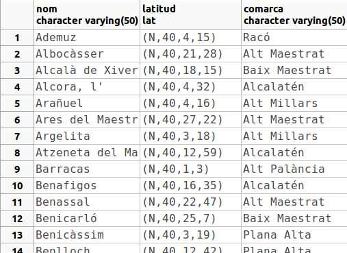
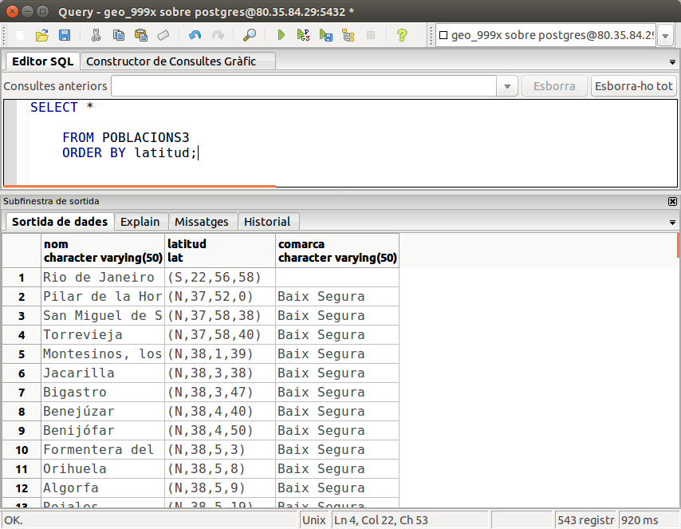

# 9. Creació d'altres objectes basats en funcions

Ara que ja sabem crear funcions, i ho hem practicat fins i tot per a crear
triggers, podríem plantejar-nos crear altres objectes, com operadors,
operadors de classe, funcions d'agregat, ..., per als quals hem d'utilitzar
funcions. Així és com veurem l'extensibilitat de PostgreSQL, com és de
versàtil i ens podem crear objectes a la nostra mida.

!!!note "Nota"  
	En pgAdmin 1.18.1 o qualsevol altra versió, no es visualitzen per defecte tots
	els tipus d'objectes de la Base de Dades. Només hem d'anar al menú **Fitxer -> Opcions** i en la pestanya **Visualitza**(**Browser**) triar els objectes
	que volem.

## 9.1 Operadors

Per a definir un nou operador especificarem el símbol que utilitzarem, el o
els operands i la funció que l'implementa.

La sintaxi és:

	CREATE OPERATOR name (  
		PROCEDURE = funcname  
		[, LEFTARG = lefttype ] [, RIGHTARG = righttype ]  
		[, COMMUTATOR = com_op ] [, NEGATOR = neg_op ]  
		...
	)

Hi ha més opcions, que per a la utilitat d'aquest curs obviarem.

  * En el nom de l'operador posarem un o més d'un caràcters de la següent llista:

**\+ - * / < > = ~ ! @ # % ^ & | ` ?**

Hi ha algunes limitacions, que podem veure en la documentació.

  * Sempre hem de posar la funció que implementa l'operador.

  * Si l'operador és d'un únic operand, l'haurem d'especificar (el de la dreta o de l'esquerra, el que preferim). Si és de dos operands s'hauren d'especificar els dos.

  * **COMMUTATOR** indica un altre operador que funciona igual canviant l'ordre dels paràmetres (en numèrics el commutador de **<** és **>**)

  * **NEGATOR** indica un altre operador equivalent a negar aquest (en numèrics el negador de **<** és **> =**)

Per exemple anem a crear l'operador **MÀXIM**(**/|**) que calcula el màxim
entre dos números. Utilitzarem la funció **MAX2** que ja tenim creada (és
l'exercici 4)

    
    
    CREATE OPERATOR /| (
    	PROCEDURE = MAX2, LEFTARG = numeric, RIGHTARG = numeric);

Podem comprovar el seu funcionament amb la sentència:

    
    
    SELECT 23 /| 15;

Recordem que els operadors estan definits per a determinats operands. Així,
per exemple, la següent sentència **no funcionarà**{.rojo} perquè no tenim definit
l'operador per a operands de text:

	SELECT 'Alfa' /| 'Beta';

  
Per a esborrar un operador utilitzarem la sentència **DROP OPERATOR** , al
qual únicament li haurem d'especificar l'operador a esborrar i entre
parèntesis els tipus implicats

    
    
    DROP OPERATOR /| (numeric, numeric);

Tampoc tenim definits els operands de comparació per al tipus **lat** , que
havíem creat. I per tant coses com aquesta **no funcionen**{.rojo}:

	SELECT * FROM POBLACIONS3  
	WHERE latitud > '(N,40,0,0)';

I si li posem el tipus del qual es tracta:

    
    
    SELECT * FROM POBLACIONS3
    	WHERE latitud > '(N,40,0,0)'::lat
    	ORDER BY nom;

potser no funcionen bé. Encara que sembla que va bé la cosa:

el que ha fet en realitat és una comparació caràcter a caràcter

Per a demostrar que no funciona bé inserim una ciutat que estiga a l'hemisferi
sud: Rio de Janeiro (ja havíem quedat que no importava si es deteriorava la
Base de Dades).

    
    
    INSERT INTO POBLACIONS3
    	VALUES('Rio de Janeiro','(S,22,56,58)'::lat, NULL);

I si tornem a executar la sentència d'abans:

    
    
    SELECT * FROM POBLACIONS3
    	WHERE latitud > '(N,40,0,0)'::lat
    	ORDER BY nom;

ara ja es veu que va malament:

Anem a intentar crear tots els operadors de comparació del tipus **lat**

Començarem per les funcions. No considerem quan un operand és nul, per fer-los
més senzills. La d'igualtat és fàcil, ja que dos latituds són iguals si ho són
tots els membres. Observeu que no hi ha problema per fer la comparació
**$1.h=$2.h** , ja que són del domini **hemi_lat** basat en el tipus caràcter:

    
    
    CREATE FUNCTION igual (lat,lat) RETURNS bool AS '
    BEGIN
    	RETURN $1.h=$2.h AND $1.g=$2.g AND $1.m=$2.m AND $1.s=$2.s;
    END; '
    LANGUAGE plpgsql;

I ara l'operador:

    
    
    CREATE OPERATOR =
    	(LEFTARG = lat,
    	RIGHTARG = lat,
    	PROCEDURE = igual,
    	COMMUTATOR = = ,
    	NEGATOR = <>);

Observeu que hem posat el commutador igual a ell mateix i el negador a
l'operador distint, encara que no el tenim definit.

Ara aquesta instrucció ja funciona:

    
    
    SELECT * FROM POBLACIONS3 
    	WHERE latitud = '(N,39,59,10)';

i fins i tot sap que ha de convertir a lat la cadena de caràcters (ja que
només té un operador = amb un operand tipus **lat**).

La funció **distint** només ha de negar l'igual. I ja podem gastar l'operador:

    
    
    CREATE FUNCTION distint (lat,lat) RETURNS bool AS '
    BEGIN
    	RETURN NOT ($1 = $2);
    END; ' 
    LANGUAGE plpgsql;
    
    
    CREATE OPERATOR <>
    	(LEFTARG = lat,
    	RIGHTARG = lat,
    	PROCEDURE = distint,
    	COMMUTATOR = <> ,
    	NEGATOR = = );

!!!note ""Nota important""
	Enguany tenim creades moltes Bases de Dades perquè l'alumnat és molt extens, i
	potser tenim un poc saturat el servidor.

	Siga per l'anterior o per alguna altra causa, estem detectant una sobrecàrrega
	entre les crides als operadors nous que estem creant.

	Per aquesta raó, encara que queda molt clara la funció **distint** (quan no
	són iguals), en compte d'utilitzar l'operador = serà millor cridar a la funció
	igual (en definitiva, l'operador = crida a la funció igual, per tant ens
	estalviem un pas). Com que anirem fent tots els operadors de comparació, si
	cridem sempre a les funcions i no a altres operadors, al final ens estalviarem
	molts passos.

	Per això, millor fer aquesta versió de la funció **distint(lat,lat)**

		
		
		CREATE OR REPLACE FUNCTION distint(lat, lat) RETURNS bool AS $cos$
		BEGIN
			RETURN NOT igual($1,$2);
		END;   
		$cos$ LANGUAGE plpgsql;

L'operador **major** és un poc més complicat. Hem de considerar una latitud
major si està més al nord. Per tant a l'hemisferi nord quan més graus més al
nord, però a l'hemisferi sud és al revés.

    
    
    CREATE FUNCTION major (lat1 lat, lat2 lat) RETURNS bool AS $cos$
    DECLARE
    	aux bool;
    BEGIN
    	IF lat1.h='N' AND lat2.h='S' THEN aux := TRUE;
    	ELSIF lat1.h='S' AND lat2.h='N' THEN aux := FALSE;
    	ELSIF lat1.h='N' AND lat2.h='N' THEN 				-- Hemisferi NORD
    		IF lat1.g > lat2.g THEN aux := TRUE;
    		ELSIF lat1.g < lat2.g THEN aux := FALSE;
    		ELSE
    			IF lat1.m > lat2.m THEN aux := TRUE;
    			ELSIF lat1.m < lat2.m THEN aux := FALSE;
    			ELSE
    				IF lat1.s > lat2.s THEN aux := TRUE;
    				ELSE aux := FALSE; -- si són iguals és fals
    				END IF;
    			END IF;
    		END IF;
    	ELSE 								-- Hemisferi SUD, al revés que al NORD
    		IF lat1.g < lat2.g THEN aux := TRUE;
    		ELSIF lat1.g > lat2.g THEN aux := FALSE;
    		ELSE
    			IF lat1.m < lat2.m THEN aux := TRUE;
    			ELSIF lat1.m > lat2.m THEN aux := FALSE;
    			ELSE
    				IF lat1.s < lat2.s THEN aux := TRUE;
    				ELSE aux := FALSE;
    				END IF;
    			END IF;
    		END IF;
    	END IF;
    	RETURN aux;
    END; $cos$ 
    LANGUAGE plpgsql;

Segurament podria haver quedat més curt, però així crec que s'entén molt bé.
Ara l'operador:

    
    
    CREATE OPERATOR >
    	(LEFTARG = lat,
    	RIGHTARG = lat,
    	PROCEDURE = major,
    	COMMUTATOR = < ,
    	NEGATOR = <= );

Podríem provar-lo així:

    
    
    SELECT * FROM POBLACIONS3 
    	WHERE latitud > '(N,40,0,0)'
    	ORDER BY NOM;

i podrem comprovar que Rio de Janeiro no apareixerà.

Afortunadament tots els altres operadors es poden derivar dels que ja tenim:

    
    
    CREATE OR REPLACE FUNCTION major_igual (lat,lat) RETURNS bool AS '
    BEGIN
    	RETURN ($1 > $2) OR ($1=$2);
    END; ' LANGUAGE plpgsql;
    
    
    CREATE OPERATOR >=
    	(LEFTARG = lat,
    	RIGHTARG = lat,
    	PROCEDURE = major_igual,
    	COMMUTATOR = <= ,
    	NEGATOR = < );

I el **menor** seria negant el major o igual i el **menor o igual** negant el
major.

!!!note ""Nota important""
	Per la mateixa raó de la nota anterior, millor fer aquesta versió de la funció
	**major_igual(lat,lat)** :

		
		
		CREATE OR REPLACE FUNCTION major_igual (lat,lat) RETURNS bool AS '
		BEGIN
			RETURN major($1,$2) OR igual($1,$2);
		END; ' LANGUAGE plpgsql;

I exactament igual amb les funcions **menor(lat,lat)** i
**menor_igual(lat,lat)**

## :pencil2: Exercicis

En la Base de Dades **geo_grup_9999x** :  
  
**Ex_16** - Crear els dos **operadors de comparació** que quedaven per al tipus
**lat** : **< **i **< =**. Primer haureu de crear les 2 funcions que queden:
**menor(lat,lat)** i **menor_igual(lat,lat)**

## 9.2 Operadors de classe

Hem fet els operadors de comparació per a un nou tipus de dades que hem creat,
però a pesar d'això, no podem ordenar per un camp d'aquest tipus, és a dir,
consultes com la següent encara no funcionen:

    
    
    SELECT *
    	FROM POBLACIONS3
    	ORDER BY latitud DESC;

observeu com la primera és Rio de Janeiro, quan havia de ser l'última.

Ens falta un pas més, construir un **OPERADOR DE CLASSE** (_**OPERATOR
CLASS**_), que permetrà indexar per un camp d'aquest tipus. Això suposarà que
podrem ordenar de forma ascendent o descendent, i que podrem crear índex
formats per camps d'aquest tipus; fins i tot podrà ser, a partir d'aquest
moment, clau principal.

Una vegada tenim **tots** els operadors de comparació, només ens resta crear
una funció de suport a l'operador i definir pròpiament l'operador de classe.

!!!note "Nota"
	Abans de continuar, estigueu segurs que teniu tots els operadors creats,
	incloent **<** i **< =**

La funció de suport ha de tenir dos paràmetres del tipus que volem, i tornar
-1, 1 o 0, depenent de si el primer operand és menor, major o igual que el
segon, respectivament.

    
    
    CREATE OR REPLACE FUNCTION lat_cmp(lat1 lat,lat2 lat) RETURNS integer AS $cos$
    BEGIN
    	IF lat1 < lat2 THEN return -1;
    	ELSEIF lat1 > lat2 THEN return 1;
    	ELSE return 0;
    	END IF;
    END;
    $cos$ LANGUAGE 'plpgsql';

Ara ja podem definir l'operador de classe. Haurem de tenir **privilegis
d'administració** (per evitar que qualsevol usuari puga crear operadors de
classe). Haurem d'especificar:

  * El tipus de dades per a qui definim l'operador de classe.

  * El mètode d'indexació que utilitzarem (normalment **btree** , _**b-arbre**_)

  * L'estratègia d'ordenació, especificant quins són els nostres operadors i associant-los a números.

  * També haurem d'especificar la funció de suport.

Lamentablement no teniu privilegis d'administració, per tant aquesta part no
la podreu fer, únicament us podreu fiar. La definició de l'operador de classe
quedarà així :

	CREATE OPERATOR CLASS lat_op_cl DEFAULT  
		FOR TYPE lat USING btree AS  
		OPERATOR 1 <,  
		OPERATOR 2 <=,  
		OPERATOR 3 =,  
		OPERATOR 4 >=,  
		OPERATOR 5 >,  
		FUNCTION 1 lat_cmp(lat, lat);

Si esteu molt molt interessats i voleu comprovar-lo, m'ho dieu a mi i us
crearé aquest operador de classe.

Ara ja ens funcionaria la següent sentència:

    
    
    SELECT *
    	FROM POBLACIONS3
    	ORDER BY latitud DESC;

observeu com estem ordenant de forma ascendent, i la primera és Rio de
Janeiro:

I fins i tot, si fóra el cas, podríem definir el camp **latitud** com a clau
principal, que no és el cas perquè ja és **nom**.

## 9.3 Funcions d'agregat

En PostgreSQL també podem definir funcions d'agregat, de l'estil de **MAX** ,
**SUM** , **AVG** , ... Podem fer-ho sobre qualsevol tipus, existent o definit
per l'usuari

Una funció d'agregat vindrà definida pel seu nom i pel tipus de dades. Per
això encara **no funciona**{.rojo} la sentència

	SELECT MAX(latitud)  
		FROM POBLACIONS3;

ja que **MAX** no està definida sobre el tipus de dades nou.

A banda del tipus de dades, podrem jugar amb un tipus de dades intern, mentre
es calcula la funció d'agregat, que no té per què ser igual al tipus de dades
de la funció. I la funció d'agregat vindrà definida per una o dues funcions:
una funció de transició d'estat (_**sfunc**_) que anirà calculant l'estat
intern mentre van arribant nous valors; i opcionalment una altra funció final
(_**ffunc**_) per a fer un últim càlcul i donar el valor final (per exemple en
la mitjana _**sfunc**_ anirà calculant la suma dels valors, i _**ffunc**_
haurà de dividir pel nombre total d'elements).

	sfunc( estat-intern, següent-item-dades ) ---> següent-estat-intern

	ffunc( estat-intern ) ---> valor-final

Opcionalment també podrem donar un valor inicial. La sintaxi és:

		CREATE AGGREGATE nom (  
			BASETYPE = tipus_dades,  
			SFUNC = sfunc,  
			STYPE = tipus_dades_intern  
			[ , FINALFUNC = ffunc ]  
			[ , INITCOND = condició_inicial ]  
			[ , SORTOP = operador_ordenació ]
		)

Anem a crear la funció d'agregat MAX per al tipus de dades lat. Comencem per
la funció d'estat, que en aquest cas senzillament anirà agafant el màxim. És,
per tant, com la funció que calcula el màxim de dos números, però en lat. No
tindrem en consideració els valors nuls, per no complicar la cosa.

    
    
    CREATE OR REPLACE FUNCTION MAX2(lat1 lat,lat2 lat) RETURNS lat AS $cos$
    BEGIN
    	IF lat2 > lat1 THEN RETURN lat2;
    	ELSE RETURN lat1;
    	END IF;
    END; $cos$ 
    LANGUAGE plpgsql;

Ara ja va la funció d'agregat:

    
    
    CREATE AGGREGATE MAX (
    	BASETYPE = lat,
    	SFUNC = MAX2,
    	STYPE = lat,
    	INITCOND = '(S,90,0,0)');

Hem posat com a valor inicial el pol sud, per evitar el problema dels nuls. Si
tot ha anat bé, ja podrem fer consultes com la del principi d'aquesta
pregunta.

    
    
    SELECT MAX(latitud)
        FROM POBLACIONS3;

Si havíem creat també l'operador de classe, les podrem complicar ordenant-les.
Per exemple, podem traure la latitud màxima de cada comarca, ordenades de nord
a sud:

    
    
    SELECT comarca,MAX(latitud)
    	FROM POBLACIONS3
    	GROUP BY comarca
    	ORDER BY MAX(latitud) DESC;

Com sempre, la sentència d'esborrar és més senzilla. Per a esborrar una funció
d'agregat, hem d'especificar el nom de la funció d'agregat i entre parèntesis
el tipus implicat:

    
    
    DROP AGGREGATE MAX (lat);

## :pencil2:  Exercicis

En la Base de Dades **geo_grup_9999x** :  
  
  
**Ex_17** - Crear la funció d'agregat **MIN** per al tipus de dades **lat**.    

Llicenciat sota la  [Llicència Creative Commons Reconeixement NoComercial
CompartirIgual 3.0](http://creativecommons.org/licenses/by-nc-sa/3.0/)

