# Exercicis de tot el tema

En la Base de Dades **gelo_local** :  

## **Funcions**
  
**Ex_F1** - Crea una funció anomenada **DEU_****Q** , que traga els **números del 1
al 10** i els seus **quadrats**. (Utilitza **RAISE NOTICE**).  
  
**Ex_F2** - Fes una altra funció, **IMP** , que traga per pantalla els números
**imparells** del 1 al 50. (Utilitza **RAISE NOTICE**).  
  
**Ex_F3** - Fes una funció anomenada **TAULA_MULT** , per a que traga la taula de
multiplicar del **paràmetre** que se li ha de passar. (Utilitza **RAISE
NOTICE**). Aquest podria ser el seu aspecte, en executar-la:

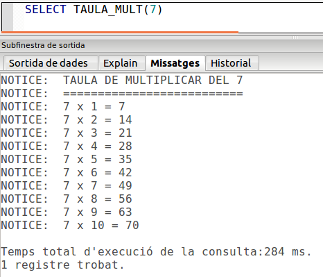

**Ex_F4** - Fes una funció, anomenada **MAX2** , que tinga dos paràmetres
**numèrics** i que **torne el màxim** entre aquestos dos. (Ara ja **no** s'ha
d'utilitzar **RAISE NOTICE**).  
  
**Ex_F5** - Utilitza l'anterior per a crear **MAX3**. Has d'utilitzar
obligatòriament la funció **MAX2**  
  
**Ex_F6** - (**Voluntari**) Fes la funció **LAT_A_TEXT** , tenint en compte que ha
de quedar com en la taula **POBLACIONS**. Segurament la dificultat més gran
serà aconseguir que apareguen les cometes després dels minuts i dels segons.

**Ex_F7** - Fes una funció anomeneda **POBLACIONS_ALTES** que accepte 2 paràmetres,
el primer de tipus text que serà una comarca, i el segon numèric que serà una
altura. Ha de traure les poblacions de la comarca del primer paràmetre que són
més altes que el segon paràmetre. Mostrarem el nom de la població i l'altura.
Aquest podria ser el resultat en executar-se:

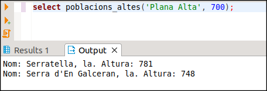

**Ex_F8** - Fes una funció anomenada **COMARQUES_NUMPOBLES** sense paràmetres que
traga per pantalla les comarques ordenades alfabèticament amb el número de
pobles de cadascuna

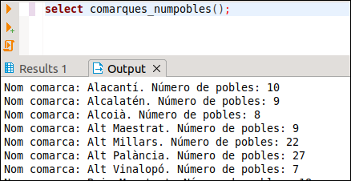

**Ex_F9** - Fes una funció anomenada **COMARQUES_NUMPOBLES_NUMINSTITUTS** sense
paràmetres que traga per pantalla les comarques ordenades alfabèticament amb
el número de pobles de cadascuna i el número d'instituts. En la consulta
tindrem dos dificultats:

  * Hem d'agafar totes les poblacions, fins i tot les que no tenen institut
  * Com que hem d'accedir als instituts, per a comptar els pobles haurem de comptar els pobles distints, i així si un poble té més d'un institut, no comptar-lo més d'una vegada

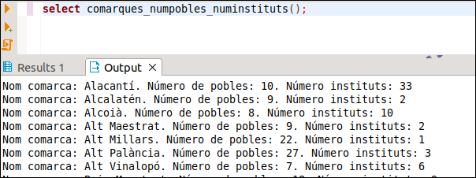

**Ex_F10** - Fes una funció anomenada **NUM_HABITANTS_COMARCA** que accepte un
paràmetre de tipus text, i torne el número d'habitants d'eixa comarca

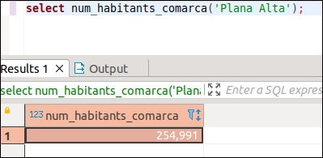

**Ex_F11** - Fer la funció **COMARQUES_NUMHABITANTS** sense paràmetres per a traure
per pantalla totes les comarques i el número d'habitants. En la consulta has
d'utilitzar obligatòriament la funció anterior

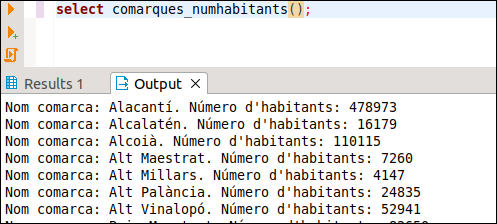

## **Trigger**

**Ex_T1** - Crear un trigger anomenat **TR_ALT_POS** que controle que l'altura
d'una nova població siga estrictament positiva. La funció en la qual es basa
es pot anomenar **ALT_POS**.

**Ex_T2** - Modificar l'anterior per a que ho controle també quan es tracta d'una
modificació.

**Ex_T3** - Crear un trigger anomenat **TR_EXT_0_1000** que controle que l'extensió
d'un municipi (població) estiga obligatòriament entre 0 i 1000, i ha de ser
sempre, tant si s'insereix una nova població com si es modifica. Però en
aquesta ocasió, en compte de traure un error, el que farem serà modificar
aquest valor: si és major que 1000, li donarem el valor 1000, i si és negatiu
li posarem 0. Ho aconseguirem modificant **NEW.extensio** , i com la funció
del trigger torna sempre NEW, doncs agafarà el nou valor. Anomeneu a la funció
**EXT_0_1000**.

**Ex_T4** - **VOLUNTARI**. En la taula POBLACIONS3 tenim controlat que la latitud
introduïda siga correcta per mig del tipus lat, però no en la taula
POBLACIONS, on és de tipus VARCHAR(50) i per tant es podria introduir una
latitud incorrecta molt fàcilment. 
Crea un trigger que controle que quan s'introdueix o es modifica la **latitud** de **POBLACIONS** siga correcta. Per a això

  * Els caràcter 1 i 2 han de ser els **graus** , que han d'estar entre 00 i 90
  * El caràcter 3 ha de ser **º**
  * Els caràcters 4 i 5 formen els **minuts** , i han d'estar entre 00 i 59
  * El caràcter 6 ha de ser **'**
  * Els caràcters 7 i 8 formen els **segons** , i han d'estar entre 00 i 59
  * El caràcter 9 ha de ser **"**
  * El caràcter 10 ha de ser **N** o **S**
  * Si no s'acompleix alguna de les restriccions anteriors, ha d'eixir un error dient que la latitud ha d'estar entre 00º00'00"N i 90º00'00"N , o entre 00º00'00"S i 90º00'00"S

**Ex_T5:** Crear un trigger que, después de una inserción, actualice automáticamente la cantidad total de habitantes en la tabla provincies cada vez que se inserta una nueva población en la tabla poblacions.

**Ex_T6:** Crear un trigger que evite la actualización del nombre de una población en la tabla poblacions3 si  existe la comarca.

**Ex_T7:** Crear un trigger que evite la inserción de un nuevo instituto en la tabla instituts si el código de la población asociada no existe en la tabla poblacions.

**Ex_T8:** Crear un trigger, MOD_LLEN, que nos avise cuando una población cambia de lengua mayoritaria.  

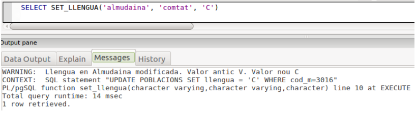

**Ex_T9:** Crea un trigger para llevar una auditoría de la tabla INSTITUTS para controlar todas las modificaciones que se hacen en la tabla. Para eso, por cada actualización hecha introduciremos una fila en la tabla AUDIT_INSTITUT (crearla previamente si no existe) con la siguiente información:

- num_a: es la clave principal de la tabla, que será un autonumérico  (SERIAL)
 	
- operacio: contendrá el tipo de operación de actualización realizada en la tabla INSTITUS, 	que podrá ser: INSERT, DELETE o UPDATE
 	
- codi_institut: código del instituto afectado por la operación de actualización.
 	
- usuari: usuario que ha realizado la operación de actualización, se puede obtener con current_user; podríamos pensar que siempre será el mismo usuario que hace la operación, pero en realidad lo puede hacer todo usuario que tenga permiso de acceso a la Base de Datos. En la imagen se puede observar cómo el usuario postgres también ha hecho una operación de actualización.d’actualització
 	
- data_op: fecha-hora (timestamp) de la actualtzación; se puede obtener con la función now()

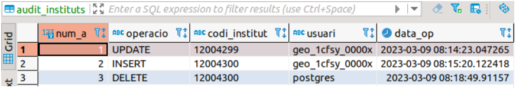

En la imagen se observa cómo se han hecho 3 actualizaciones desde el momento de creación del trigger, la última de ellas realizada por el usuario  postgres

**Ex_T10:** Crear un trigger que registre automáticamente en una tabla de auditoría, cada vez que se actualiza la población en la tabla poblacions, pero sólo si la población aumenta en más del 10%. En la tabla se guardará el valor de la población antes de ser actualizado. Crear la tabla audit_poblacions previamente, si no existe, con la siguiente información:
 cod_m: códido de población
 fecha:  fecha modificación
 poblacion_anterior:  población antes de la actualización.

## **Cursors**

**Ex_C1:** Crea una función que tome el nombre de una comarca como parámetro y muestre una lista de poblaciones en esa comarca junto con sus habitantes.

      select lista_poblaciones_por_comarca('Racó');

      Población: Ademuz -- habitantes:1179
      Población: Casas Altas -- habitantes:149
      Población: Casas Bajas -- habitantes:195
      Población: Castielfabib -- habitantes:282
      Población: Vallanca -- habitantes:156
      Población: Torrebaja -- habitantes:429
      Población: Puebla de San Miguel -- habitantes:71

**Ex_C2:** Crea una función que muestre el nombre de la comarca y el promedio de altura de todas las poblaciones de la misma comarca, ordenado por comarca. Al final devuelve el número total de comarcas.

      Comarca: Alt Vinalopó -- Promedio altura: 580.1428571428571429
      Comarca: Baix Maestrat -- Promedio altura: 316.4444444444444444
      Comarca: Baix Segura -- Promedio altura: 25.8518518518518519
      Comarca: Baix Vinalopó -- Promedio altura: 74.0000000000000000
      Comarca: Camp de Morvedre -- Promedio altura: 95.3125000000000000
      Comarca: Camp de Túria -- Promedio altura: 198.4000000000000000
      Comarca: Canal de Navarrés -- Promedio altura: 261.5000000000000000
      Comarca: Comtat -- Promedio altura: 552.4583333333333333
      Comarca: Costera -- Promedio altura: 170.6842105263157895
      Comarca: Foia de Bunyol -- Promedio altura: 361.8888888888888889
      Comarca: Horta Nord -- Promedio altura: 22.0476190476190476
      ..............................
      total comarcas:34

**Ex_C3:** Crea una función que muestre el nombre de la población y la cantidad de institutos asociados, incluso los que tienen 0 institutos, ordenado por institutos.

      ............................
      Población: Xàtiva -- Institutos: 3
      Población: Xella -- Institutos: 0
      Población: Xeraco -- Institutos: 1
      Población: Xeresa -- Institutos: 0
      Población: Xert -- Institutos: 0
      Población: Xilxes -- Institutos: 0
      Población: Xirivella -- Institutos: 2
      Población: Xixona -- Institutos: 1
      Población: Xodos -- Institutos: 0
      Población: Yátova -- Institutos: 0
      Población: Yesa, la -- Institutos: 0
      Población: Zarra -- Institutos: 0
      Población: Zucaina -- Institutos: 0

**Ex_C4:**  Crea una función que tome el nombre de una comarca como parámetro y muestre la población y la altura de la población con la altura más alta.

      select altura_maxima_por_comarca('Alacantí');

      Población: Torre de les Maçanes, la --  altura máxima: 788

**Ex_C5:** Crea una función que muestre el nombre y la altura de las poblaciones que tienen alturas superiores al promedio.

      Población: Ademuz --  altura: 660
      Población: Agost --  altura: 376
      Población: Agres --  altura: 722
      Población: Agullent --  altura: 360
      Población: Aigües --  altura: 341
      Población: Aín --  altura: 498
      Población: Albaida --  altura: 315
      Población: Albocàsser --  altura: 538
      Población: Alborache --  altura: 320

**Ex_C6:** Crea una función que tome dos nombres de provincias como parámetros y devuelva la diferencia absoluta de población entre ambas provincias.

      select diferencia_poblacion_entre_provincias('València', 'Alacant');

      RETURN: 680.460

**Ex_C7:** Crea una función que muestre el nombre de las poblaciones que no tienen institutos asociados en la tabla instituts, ordenado por población.

      Población: Ador
      Población: Agres
      Población: Agullent
      Población: Aielo de Rugat
      Población: Aigües
      Población: Aín
      Población: Albalat dels Sorells
      Población: Albalat dels Tarongers
      Población: Albocàsser
      Población: Alborache
      Población: Albuixech
      Población: Alcalalí

**Ex_C8:** Crea una función que muestre el nombre de las poblaciones que tienen una población por debajo del promedio.

      
      Promedio= 9234.0295

      Población: Ademuz habitantes: 1179
      Población: Ador habitantes: 1411
      Población: Agost habitantes: 4752
      Población: Agres habitantes: 583
      Población: Agullent habitantes: 2435
      Población: Aielo de Malferit habitantes: 4657
      Población: Aielo de Rugat habitantes: 166
      Población: Aigües habitantes: 984
      Población: Aín habitantes: 129
      Población: Albaida habitantes: 6031

**Ex_C9:** Crea una función que dado el nombre de una población y una comarca nos permita establecer la lengua para esa población.

      SELECT SET_LLENGUA('Almudaina','Comtat','V');

      RETURN: void

**Ex_C10:** Crea una función llamada Densidad_centros que dado el nombre de una comarca nos devuelva la cantidad de centros que tiene por unidad de superficie.

      SELECT DENSIDAD_CENTRES('Plana Alta');

      RETURN: 0.0219

**Ex_C11:** La misma función del ejercicio anterior pero utilizando cursor explícito.

**Ex_C12:** Crea una función, utilizando al menos un cursor explícito, llamada ALTURA_MITJA, que nos permita obtener la altura media a la que están los centros en función de la comarca y de la lengua de la población (estos serán los parámetros de entrada).

      SELECT ALTURA_MITJA ('Comtat'.'v');

      RETURN: 455

**Ex_C13:** Crea una función, utilizando cursores, llamada POBLACIONS_GRANS que dado el nombre de una comarca nos devuelva los nombres de las poblaciones de la comarca que tienen una población superior en un 50% a la media de población de la provincia.

      
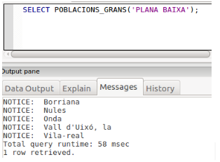
      

**Ex_C14:** Crea una función, utilizando cursores, llamada CENTRES_DUO , que dado el nombre de una comarca nos devuelva la cantidad total de centros de las dos poblaciones con mayor número de habitantes.

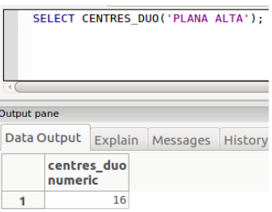

**Ex_C15:** Crea una función  llamada INTRODUCIR_INSTITUTO(varchar,varchar,varchar,varchar,numeric,numeric), que acepte los parámetros indicados, uno por cada campo de la tabla INSTITUTS, que compruebe:

- Que el primer parámetro, el código del instituto, tenga exactamente 8 caracteres y que comience por 03, 12 o 46 (los códigos de provincia)
- Que el código postal esté entre 3001 y 3999, 12001 y 12999 o 46001 y 46999.
Observa que el cod_m no hará falta comprobarlo, ya que es clave externa y saltaría el error si no es un código de municipio existente.

>      select introduir_intitut('46000000','Institut de prova','Castello','s/n',3001,12028);
>      select introduir_intitut('03000000','Institut de prova','Castello','s/n',3001,12028);

<!--
**Ex_16** - Crear els dos **operadors de comparació** que quedaven per al tipus
**lat** : **< **i **< =**

**Ex_17** - Crear la funció d'agregat **MIN** per al tipus de dades **lat**.

-->
<!--
**Ex_18** - Fes una funció en PL/pgSQL anomenada
**DENSITAT_CENTRES** que donat el nom d'una comarca ens torne la quantitat de
centres que té per unitat de superfície.

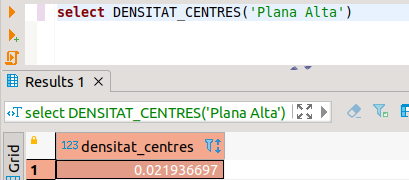

**Ex_19** - Fes una funció anomenada
**introduir_institut(varchar,varchar,varchar,varchar,numeric,numeric)** , que
accepte els paràmetres indicats, un per cada camp de la taula INSTITUTS, que
comprove:

  * Que el primer paràmetre, el codi de l’institut, tinga exactament 8 caràcters i que comence per 03, 12 o 46 (els codis de província)
  * Que el codi postal estiga entre 3001 i 3999, 12001 i 12999 o 46001 i 46999
  * Observa que el cod_m no caldrà comprovar-lo, ja que és clau externa i saltaria l’error si no és un codi de municipi existent

En cas que tot siga correcte, s’ha d’introduir el nou institut. En cas
contrari ha de saltar un error

**Ex_20** - Fes un trigger per a portar una auditoria de la taula
**INSTITUTS** per a controlar totes les modificacions que es fan en la taula
INSTITUTS. Per a això per cada actualització feta, introduirem una fila en la
taula nova anomenada**AUDIT_INSTITUT** (creant-la prèviament si no existeix)
amb la següent informació:

  * **num_a** : és la clau principal de la taula, que serà un autonumèric (SERIAL)
  * **operacio** : contindrà el tipus d’operació d’actualització realitzada en la taula INSTITUTS, que podrà ser: INSERT, DELETE o UPDATE
  * **codi_institut** : codi del institut afectat per l’operació d’actualització
  * **usuari** : usuari que ha realitzat l’operació d’actualització; es pot obtenir amb **current_user** ;  
podríem pensar que sempre serà el mateix usuari qui fa l’operació, però en
realitat ho pot fer tot usuari que tinga permís d’accés a la Base de Dades. En
la imatge es pot observar com l’usuari **postgres** també ha fet una operació
d’actualització

  * **data_op** : data-hora (timestamp) de l’actualització; es pot obtenir amb la funció **now()**

En la imatge s’observa com s’han fet 3 actualitzacions des del moment de
creació del trigger, l’ultima d’elles realitzada per l’usuari **postgres**.
Evidentment, la manera de comprovar-lo vosaltres és fer operacions
d'actualització i el resultat ha de ser obligatòriament deferent:

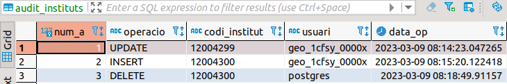
-->

Llicenciat sota la  [Llicència Creative Commons Reconeixement NoComercial
CompartirIgual 3.0](http://creativecommons.org/licenses/by-nc-sa/3.0/)

