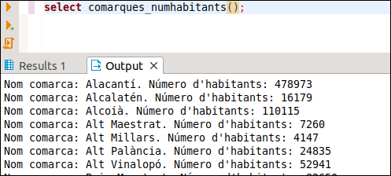

# Exercicis de tot el tema

En la Base de Dades **geo_grup_9999x** :  
  
**Ex_1** - Crea una funció anomenada **DEU_****Q** , que traga els **números del 1
al 10** i els seus **quadrats**. (Utilitza **RAISE NOTICE**).  
  
**Ex_2** - Fes una altra funció, **IMP** , que traga per pantalla els números
**imparells** del 1 al 50. (Utilitza **RAISE NOTICE**).  
  
**Ex_3** - Fes una funció anomenada **TAULA_MULT** , per a que traga la taula de
multiplicar del **paràmetre** que se li ha de passar. (Utilitza **RAISE
NOTICE**). Aquest podria ser el seu aspecte, en executar-la:

**Ex_4** - Fes una funció, anomenada **MAX2** , que tinga dos paràmetres
**numèrics** i que **torne el màxim** entre aquestos dos. (Ara ja **no** s'ha
d'utilitzar **RAISE NOTICE**).  
  
**Ex_5** - Utilitza l'anterior per a crear **MAX3**. Has d'utilitzar
obligatòriament la funció **MAX2**  
  
**Ex_6** - (**Voluntari**) Fes la funció **LAT_A_TEXT** , tenint en compte que ha
de quedar com en la taula **POBLACIONS**. Segurament la dificultat més gran
serà aconseguir que apareguen les cometes després dels minuts i dels segons.

**Ex_7** - Fes una funció anomeneda **POBLACIONS_ALTES** que accepte 2 paràmetres,
el primer de tipus text que serà una comarca, i el segon numèric que serà una
altura. Ha de traure les poblacions de la comarca del primer paràmetre que són
més altes que el segon paràmetre. Mostrarem el nom de la població i l'altura.
Aquest podria ser el resultat en executar-se:

**Ex_8** - Fes una funció anomenada **COMARQUES_NUMPOBLES** sense paràmetres que
traga per pantalla les comarques ordenades alfabèticament amb el número de
pobles de cadascuna

**Ex_9** - Fes una funció anomenada **COMARQUES_NUMPOBLES_NUMINSTITUTS** sense
paràmetres que traga per pantalla les comarques ordenades alfabèticament amb
el número de pobles de cadascuna i el número d'instituts. En la consulta
tindrem dos dificultats:

  * Hem d'agafar totes les poblacions, fins i tot les que no tenen institut
  * Com que hem d'accedir als instituts, per a comptar els pobles haurem de comptar els pobles distints, i així si un poble té més d'un institut, no comptar-lo més d'una vegada

**Ex_10** - Fes una funció anomenada **NUM_HABITANTS_COMARCA** que accepte un
paràmetre de tipus text, i torne el número d'habitants d'eixa comarca

**Ex_11** - Fer la funció **COMARQUES_NUMHABITANTS** sense paràmetres per a traure
per pantalla totes les comarques i el número d'habitants. En la consulta has
d'utilitzar obligatòriament la funció anterior

**Ex_12** - Crear un trigger anomenat **TR_ALT_POS** que controle que l'altura
d'una nova població siga estrictament positiva. La funció en la qual es basa
es pot anomenar **ALT_POS**.

**Ex_13** - Modificar l'anterior per a que ho controle també quan es tracta d'una
modificació.

**Ex_14** - Crear un trigger anomenat **TR_EXT_0_1000** que controle que l'extensió
d'un municipi (població) estiga obligatòriament entre 0 i 1000, i ha de ser
sempre, tant si s'insereix una nova població com si es modifica. Però en
aquesta ocasió, en compte de traure un error, el que farem serà modificar
aquest valor: si és major que 1000, li donarem el valor 1000, i si és negatiu
li posarem 0. Ho aconseguirem modificant **NEW.extensio** , i com la funció
del trigger torna sempre NEW, doncs agafarà el nou valor. Anomeneu a la funció
**EXT_0_1000**.

**Ex_15** - **VOLUNTARI**. En la taula POBLACIONS3 tenim controlat que la latitud
introduïda siga correcta per mig del tipus lat, però no en la taula
POBLACIONS, on és de tipus VARCHAR(50) i per tant es podria introduir una
latitud incorrecta molt fàcilment. Crea un trigger que controle que quan
s'introdueix o es modifica la **latitud** de **POBLACIONS** siga correcta. Per
a això

  * Els caràcter 1 i 2 han de ser els **graus** , que han d'estar entre 00 i 90
  * El caràcter 3 ha de ser **º**
  * Els caràcters 4 i 5 formen els **minuts** , i han d'estar entre 00 i 59
  * El caràcter 6 ha de ser **'**
  * Els caràcters 7 i 8 formen els **segons** , i han d'estar entre 00 i 59
  * El caràcter 9 ha de ser **"**
  * El caràcter 10 ha de ser **N** o **S**
  * Si no s'acompleix alguna de les restriccions anteriors, ha d'eixir un error dient que la latitud ha d'estar entre 00º00'00"N i 90º00'00"N , o entre 00º00'00"S i 90º00'00"S

**Ex_16** - Crear els dos **operadors de comparació** que quedaven per al tipus
**lat** : **< **i **< =**

**Ex_17** - Crear la funció d'agregat **MIN** per al tipus de dades **lat**.

<!--
**Ex_18** - Fes una funció en PL/pgSQL anomenada
**DENSITAT_CENTRES** que donat el nom d'una comarca ens torne la quantitat de
centres que té per unitat de superfície.

**Ex_19** - Fes una funció anomenada
**introduir_institut(varchar,varchar,varchar,varchar,numeric,numeric)** , que
accepte els paràmetres indicats, un per cada camp de la taula INSTITUTS, que
comprove:

  * Que el primer paràmetre, el codi de l’institut, tinga exactament 8 caràcters i que comence per 03, 12 o 46 (els codis de província)
  * Que el codi postal estiga entre 3001 i 3999, 12001 i 12999 o 46001 i 46999
  * Observa que el cod_m no caldrà comprovar-lo, ja que és clau externa i saltaria l’error si no és un codi de municipi existent

En cas que tot siga correcte, s’ha d’introduir el nou institut. En cas
contrari ha de saltar un error

**Ex_20** - Fes un trigger per a portar una auditoria de la taula
**INSTITUTS** per a controlar totes les modificacions que es fan en la taula
INSTITUTS. Per a això per cada actualització feta, introduirem una fila en la
taula nova anomenada**AUDIT_INSTITUT** (creant-la prèviament si no existeix)
amb la següent informació:

  * **num_a** : és la clau principal de la taula, que serà un autonumèric (SERIAL)
  * **operacio** : contindrà el tipus d’operació d’actualització realitzada en la taula INSTITUTS, que podrà ser: INSERT, DELETE o UPDATE
  * **codi_institut** : codi del institut afectat per l’operació d’actualització
  * **usuari** : usuari que ha realitzat l’operació d’actualització; es pot obtenir amb **current_user** ;  
podríem pensar que sempre serà el mateix usuari qui fa l’operació, però en
realitat ho pot fer tot usuari que tinga permís d’accés a la Base de Dades. En
la imatge es pot observar com l’usuari **postgres** també ha fet una operació
d’actualització

  * **data_op** : data-hora (timestamp) de l’actualització; es pot obtenir amb la funció **now()**

En la imatge s’observa com s’han fet 3 actualitzacions des del moment de
creació del trigger, l’ultima d’elles realitzada per l’usuari **postgres**.
Evidentment, la manera de comprovar-lo vosaltres és fer operacions
d'actualització i el resultat ha de ser obligatòriament deferent:

-->

Llicenciat sota la  [Llicència Creative Commons Reconeixement NoComercial
CompartirIgual 3.0](http://creativecommons.org/licenses/by-nc-sa/3.0/)

