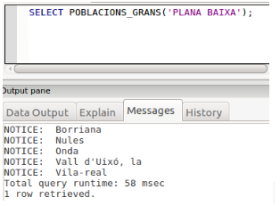
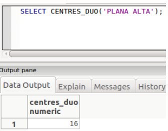
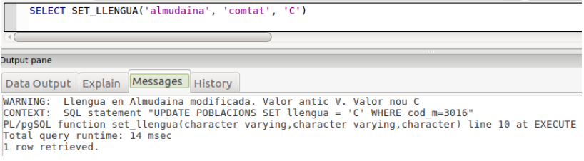
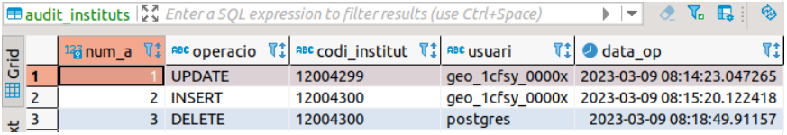

# Exercicis de repàs

## **Cursors**{.azul}

**Ejercicio C1:** Crea una función que tome el nombre de una comarca como parámetro y muestre una lista de poblaciones en esa comarca junto con sus habitantes.

      select lista_poblaciones_por_comarca('Racó');

      Población: Ademuz -- habitantes:1179
      Población: Casas Altas -- habitantes:149
      Población: Casas Bajas -- habitantes:195
      Población: Castielfabib -- habitantes:282
      Población: Vallanca -- habitantes:156
      Población: Torrebaja -- habitantes:429
      Población: Puebla de San Miguel -- habitantes:71

**Ejercicio C2:** Crea una función que muestre el nombre de la comarca y el promedio de altura de todas las poblaciones de la misma comarca, ordenado por comarca. Al final devuelve el número total de comarcas.

      Comarca: Alt Vinalopó -- Promedio altura: 580.1428571428571429
      Comarca: Baix Maestrat -- Promedio altura: 316.4444444444444444
      Comarca: Baix Segura -- Promedio altura: 25.8518518518518519
      Comarca: Baix Vinalopó -- Promedio altura: 74.0000000000000000
      Comarca: Camp de Morvedre -- Promedio altura: 95.3125000000000000
      Comarca: Camp de Túria -- Promedio altura: 198.4000000000000000
      Comarca: Canal de Navarrés -- Promedio altura: 261.5000000000000000
      Comarca: Comtat -- Promedio altura: 552.4583333333333333
      Comarca: Costera -- Promedio altura: 170.6842105263157895
      Comarca: Foia de Bunyol -- Promedio altura: 361.8888888888888889
      Comarca: Horta Nord -- Promedio altura: 22.0476190476190476
      ..............................
      total comarcas:34

**Ejercicio C3:** Crea una función que muestre el nombre de la población y la cantidad de institutos asociados, incluso los que tienen 0 institutos, ordenado por institutos.

      ............................
      Población: Xàtiva -- Institutos: 3
      Población: Xella -- Institutos: 0
      Población: Xeraco -- Institutos: 1
      Población: Xeresa -- Institutos: 0
      Población: Xert -- Institutos: 0
      Población: Xilxes -- Institutos: 0
      Población: Xirivella -- Institutos: 2
      Población: Xixona -- Institutos: 1
      Población: Xodos -- Institutos: 0
      Población: Yátova -- Institutos: 0
      Población: Yesa, la -- Institutos: 0
      Población: Zarra -- Institutos: 0
      Población: Zucaina -- Institutos: 0

**Ejercicio C4:**  Crea una función que tome el nombre de una comarca como parámetro y muestre la población y la altura de la población con la altura más alta.

      select altura_maxima_por_comarca('Alacantí');

      Población: Torre de les Maçanes, la --  altura máxima: 788

**Ejercicio C5:** Crea una función que muestre el nombre y la altura de las poblaciones que tienen alturas superiores al promedio.

      Población: Ademuz --  altura: 660
      Población: Agost --  altura: 376
      Población: Agres --  altura: 722
      Población: Agullent --  altura: 360
      Población: Aigües --  altura: 341
      Población: Aín --  altura: 498
      Población: Albaida --  altura: 315
      Población: Albocàsser --  altura: 538
      Población: Alborache --  altura: 320

**Ejercicio C6:** Crea una función que tome dos nombres de provincias como parámetros y devuelva la diferencia absoluta de población entre ambas provincias.

      select diferencia_poblacion_entre_provincias('València', 'Alacant');

      RETURN: 680.460

**Ejercicio C7:** Crea una función que muestre el nombre de las poblaciones que no tienen institutos asociados en la tabla instituts, ordenado por población.

      Población: Ador
      Población: Agres
      Población: Agullent
      Población: Aielo de Rugat
      Población: Aigües
      Población: Aín
      Población: Albalat dels Sorells
      Población: Albalat dels Tarongers
      Población: Albocàsser
      Población: Alborache
      Población: Albuixech
      Población: Alcalalí

**Ejercicio C8:** Crea una función que muestre el nombre de las poblaciones que tienen una población por debajo del promedio.

      
      Promedio= 9234.0295

      Población: Ademuz habitantes: 1179
      Población: Ador habitantes: 1411
      Población: Agost habitantes: 4752
      Población: Agres habitantes: 583
      Población: Agullent habitantes: 2435
      Población: Aielo de Malferit habitantes: 4657
      Población: Aielo de Rugat habitantes: 166
      Población: Aigües habitantes: 984
      Población: Aín habitantes: 129
      Población: Albaida habitantes: 6031

**Ejercicio C9:** Crea una función que dado el nombre de una población y una comarca nos permita establecer la lengua para esa población.

      SELECT SET_LLENGUA('Almudaina','Comtat','V');

      RETURN: void

**Ejercicio C10:** Crea una función llamada Densidad_centros que dado el nombre de una comarca nos devuelva la cantidad de centros que tiene por unidad de superficie.

      SELECT DENSIDAD_CENTRES('Plana Alta');

      RETURN: 0.0219

**Ejercicio C11:** La misma función del ejercicio anterior pero utilizando cursor explícito.

**Ejercicio C12:** Crea una función, utilizando al menos un cursor explícito, llamada ALTURA_MITJA, que nos permita obtener la altura media a la que están los centros en función de la comarca y de la lengua de la población (estos serán los parámetros de entrada).

      SELECT ALTURA_MITJA ('Comtat'.'v');

      RETURN: 455

**Ejercicio C13:** Crea una función, utilizando cursores, llamada POBLACIONS_GRANS que dado el nombre de una comarca nos devuelva los nombres de las poblaciones de la comarca que tienen una población superior en un 50% a la media de población de la provincia.

      

      

**Ejercicio C14:** Crea una función, utilizando cursores, llamada CENTRES_DUO , que dado el nombre de una comarca nos devuelva la cantidad total de centros de las dos poblaciones con mayor número de habitantes.

**Ejercicio C15:** Crea una función  llamada INTRODUCIR_INSTITUTO(varchar,varchar,varchar,varchar,numeric,numeric), que acepte los parámetros indicados, uno por cada campo de la tabla INSTITUTS, que compruebe:

- Que el primer parámetro, el código del instituto, tenga exactamente 8 caracteres y que comience por 03, 12 o 46 (los códigos de provincia)
- Que el código postal esté entre 3001 y 3999, 12001 y 12999 o 46001 y 46999.
Observa que el cod_m no hará falta comprobarlo, ya que es clave externa y saltaría el error si no es un código de municipio existente.

>      select introduir_intitut('46000000','Institut de prova','Castello','s/n',3001,12028);
>      select introduir_intitut('03000000','Institut de prova','Castello','s/n',3001,12028);

## **Triggers**{.azul}

**Ejercicio T1:** Crear un trigger que, después de una inserción, actualice automáticamente la cantidad total de habitantes en la tabla provincies cada vez que se inserta una nueva población en la tabla poblacions.

**Ejercicio T2:** Crear un trigger que evite la actualización del nombre de una población en la tabla poblacions3 si  existe la comarca.

**Ejercicio T3:** Crear un trigger que evite la inserción de un nuevo instituto en la tabla instituts si el código de la población asociada no existe en la tabla poblacions.

**Ejercicio T4:** Crear un trigger, MOD_LLEN, que nos avise cuando una población cambia de lengua mayoritaria.  

**Ejercicio T5:** Crea un trigger para llevar una auditoría de la tabla INSTITUTS para controlar todas las modificaciones que se hacen en la tabla. Para eso, por cada actualización hecha introduciremos una fila en la tabla AUDIT_INSTITUT (crearla previamente si no existe) con la siguiente información:

- num_a: es la clave principal de la tabla, que será un autonumérico  (SERIAL)
 	
- operacio: contendrá el tipo de operación de actualización realizada en la tabla INSTITUS, 	que podrá ser: INSERT, DELETE o UPDATE
 	
- codi_institut: código del instituto afectado por la operación de actualización.
 	
- usuari: usuario que ha realizado la operación de actualización, se puede obtener con current_user; podríamos pensar que siempre será el mismo usuario que hace la operación, pero en realidad lo puede hacer todo usuario que tenga permiso de acceso a la Base de Datos. En la imagen se puede observar cómo el usuario postgres también ha hecho una operación de actualización.d’actualització
 	
- data_op: fecha-hora (timestamp) de la actualtzación; se puede obtener con la función now()

En la imagen se observa cómo se han hecho 3 actualizaciones desde el momento de creación del trigger, la última de ellas realizada por el usuario  postgres

**Ejercicio T6:** Crear un trigger que registre automáticamente en una tabla de auditoría, cada vez que se actualiza la población en la tabla poblacions, pero sólo si la población aumenta en más del 10%. En la tabla se guardará el valor de la población antes de ser actualizado. Crear la tabla audit_poblacions previamente, si no existe, con la siguiente información:
 cod_m: códido de población
 fecha:  fecha modificación
 poblacion_anterior:  población antes de la actualización.

## **Operadors**{.azul}

**Ejercicio O1:** Crea el operador <| para mostrar el área del triángulo de dos operandos. Evidentemente se basará en una función que puedes llamar Triangulo con 2 parámetros numéricos, que serán la base y la altura del triangulo, y calculará su área. El resultado devuelto, por tanto, también será un numérico. Puedes comprobarlo con  SELECT 4 <| 3 que debe dar 6.

**Ejercicio O2:** Crea dos operadores: <^ y >^,   que comparen si el primer número (numeric) es mayor que el doble del segundo (numeric) y devuelve un valor booleano en consecuencia.

## **Funcions d'agregat**{.azul}

**Ejercicio FA1:** Crea la función agregada SumaDoble que obtenga el total del doble de los valores de una columna de una tabla.

**Ejercicio FA2:** crear una función agregada que calcule la raíz cuadrada de  la suma del cuadrado de los valores de una columna de una tabla. 

Llicenciat sota la  [Llicència Creative Commons Reconeixement NoComercial
CompartirIgual 3.0](http://creativecommons.org/licenses/by-nc-sa/3.0/)

